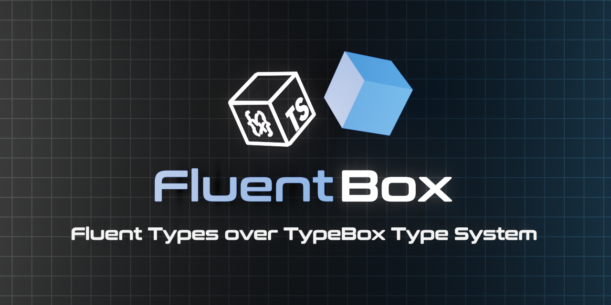

<div align='center'>

<h1>FluentBox</h1>

<p>Fluent Types for the TypeBox Type System</p>
	


<br />

</div>

## Example

```typescript
import { Type, Static } from './fluent'

const T = Type.String().StartsWith('hello').MaxLength(10).Compile()

console.log(T.Code)               // print validation code for this type

console.log(T.Schema)             // print the JSON schema for this type

const R = T.Parse('hello world')  // const R = true
```

## Overview

FluentBox is a chainable type compositor for TypeBox. It is built over the core TypeBox infrastructure and provides fluent interface for composing types. It is modelled on Yup, Zod and Joi, but provides additional capabilities such as type JIT compilation for types, value parsing and value initialization. FluentBox is implemented entirely within `fluent.ts` file located in this directory. Developers can copy and past this file into their projects to experiment with this API. Feedback welcome.

License MIT


